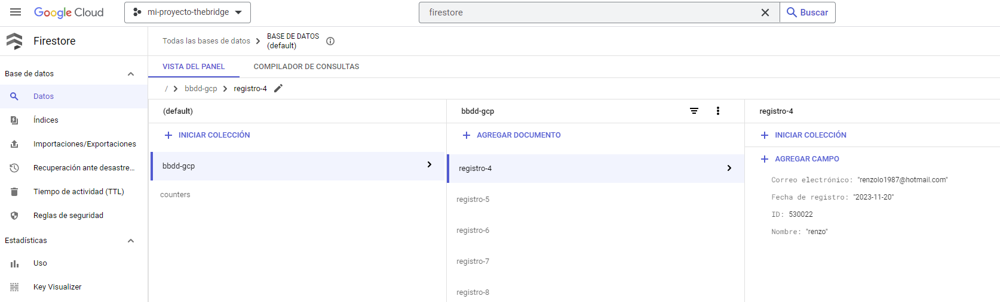
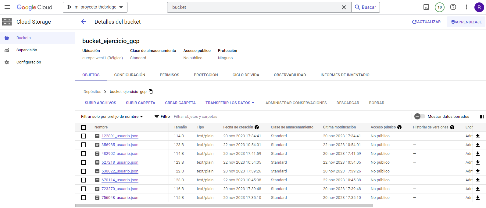
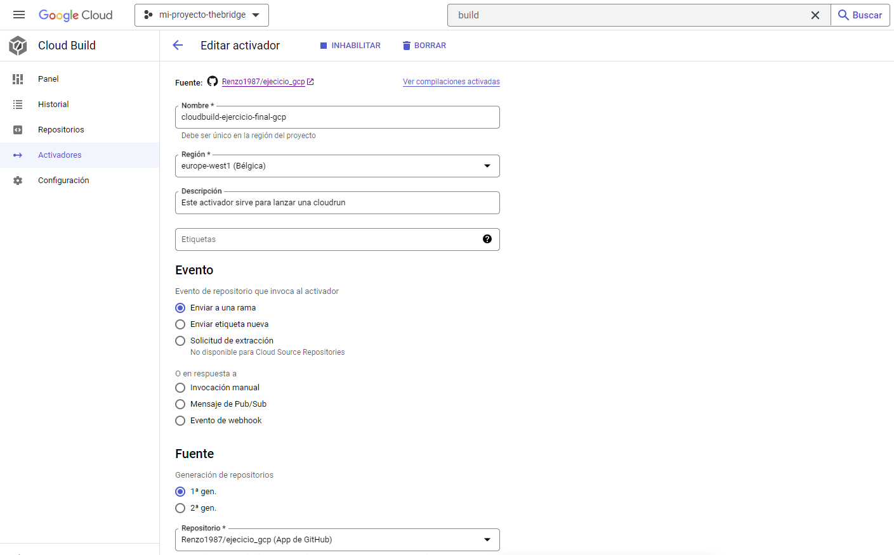
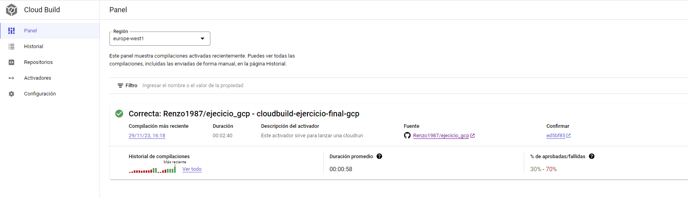
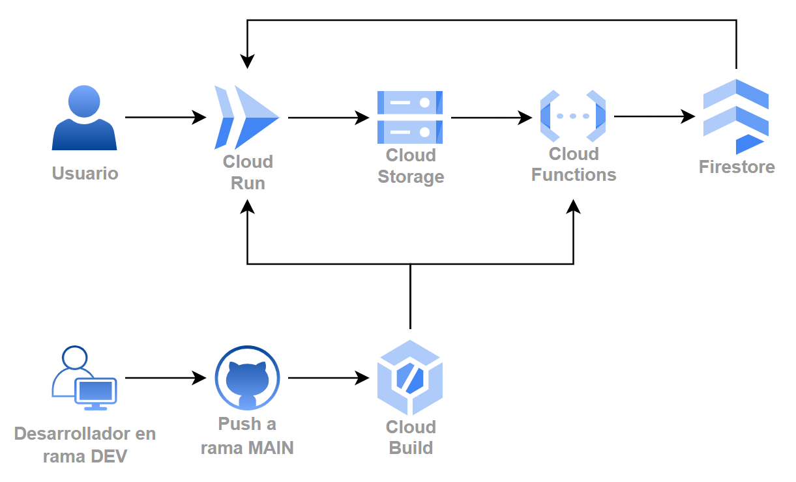

# Ejercicio Google Cloud Platform

## Parte 1 - Desplegar una cloud function:

### Planteamiento:

>Este desarrollo propone trabajar con datos donde cada vez que se crea un fichero Json en un almacenamiento, se lance una función que guarde el contenido de ese fichero en una base de datos.
> 
>
>
>Se trabaja de manera agil e intentando ir al mínimo viable por lo que el primer objetivo es utilizar google cloud platform para crear una base de datos en firestore, luego crear una cloud function que reciba a mano un json y por último que ese json lo lea desde un bucket en cloud storage. La estructura del Json que reciben es la siguiente:

```json
{
    "ID": 123456,
    "Nombre": "Juan Pérez",
    "Correo electrónico": "juan.perez@example.com",
    "Fecha de registro": "2022-01-01T10:00:00Z"
}
```

### Resolución:

Empezamos creando la base de datos con una colección llamada `bbdd-gcp`, y un bucket de cloud storage llamado `bucket-ejercicio-gcp`.

 



Después preparamos una cloud function con un trigger que se lance cuando un fichero se suba al bucket. La función se compondrá por un fichero de texto y un fichero python:

**requirements.txt** - Utilizado para instalar las dependencias de la cloud function:
```
# Function dependencies, for example:
# package>=version

google-cloud-firestore
google-cloud-storage
```
 
 **main.py** - Principal componente para el funcionamiento de la función:

```python
import json
from google.cloud import storage, firestore

storage_client = storage.Client()
firestore_client = firestore.Client()

def read_json_from_gcs(event, context):
    # Obtener el nombre del archivo JSON creado en Cloud Storage
    bucket_name = "bucket_ejercicio_gcp"
    file_name = event['name']

    # Obtener el objeto JSON desde Cloud Storage
    bucket = storage_client.bucket(bucket_name)
    blob = bucket.blob(file_name)
    content = blob.download_as_text()

    # Convertir el JSON a un diccionario de Python
    data = json.loads(content)

    # Obtener el contador actual desde Firestore
    counter_doc_ref = firestore_client.collection("counters").document("registro-counter")
    counter_data = counter_doc_ref.get().to_dict()

    if counter_data is None:
        # Si el contador no existe, lo inicializa en 1
        counter_value = 1
    else:
        # Si el contador existe, incrementa su valor
        counter_value = counter_data.get("value", 1) + 1

    # Actualizar el contador en Firestore
    counter_doc_ref.set({"value": counter_value})

    # Construir el nombre descriptivo del registro
    registro_name = f"registro-{counter_value}"

    # Guardar los datos en Firestore con el nombre descriptivo
    collection_name = "bbdd-gcp"
    firestore_client.collection(collection_name).document(registro_name).set(data)

    print(f"Datos guardados correctamente en la bbdd como {registro_name}")
```

## Parte 2 - Crear una aplicación web:

### Planteamiento:

>El siguiente requerimiento es realizar una página web que muestre toda la base de datos de usuario y la realización de un formulario web, para no tener que rellenar a mano los json de usuarios y guardarlos en el almacenamiento. Como primeros pasos, sirve realizar la ejecución de la web en local, y si es viable, se plantean ejecutarlo en una instancia de cloud engine. 
>
>
>
>Para ello se plantea crear una aplicación web que levante un formulario y que al guardar genere un fichero json en el bucket. Cuando se genere este fichero, al crearse el registro en el cloud storage, se disparará automáticamente la cloud función que dispare el primer requerimiento y a su vez, quedará actualizado en la app de seguimiento de usuarios y se mostrarán los datos en la web.

### Resolución:

La aplicación web, creada con *dash*, esta compuesta por un fichero python:

**app.py** Codigo de la pagina:

``` python 
import dash
from dash import dcc
from dash import html
from dash import dash_table
import random
import datetime
import json
from google.cloud import firestore, storage


# Inicializa Storage
client = storage.Client()
bucket_name = 'bucket_ejercicio_gcp'

today = datetime.date.today().strftime('%Y-%m-%d')

# Inicializa Firestore
db = firestore.Client()
tabla_usuarios = db.collection('bbdd-gcp')


# Creacion de funcion para obtener datos de la firestore
def obtener_datos_firesore():
    docs = tabla_usuarios.stream()
    items = [doc.to_dict() for doc in docs]
    return items

# Configura la aplicación Dash
app = dash.Dash(__name__, suppress_callback_exceptions=True)

app.layout = html.Div([
    html.H1('Menú de Navegación'),  # Título de la página

    # Menú de navegación
    dcc.Link('Formulario de Usuarios', href='/formulario'),  # Enlace al formulario
    html.Br(),  # Salto de línea
    dcc.Link('Tabla de Usuarios', href='/tabla_usuarios'),  # Enlace a la tabla de usuarios
    html.Br(),  # Salto de línea

     # Aquí se mostrará el contenido de las páginas
    dcc.Location(id='url', refresh=False),
    html.Div(id='page-content')
])

 # Callback para cargar el contenido de las páginas
@app.callback(
    dash.dependencies.Output('page-content', 'children'),
    [dash.Input('url', 'pathname')]
)
def display_page(pathname):
    if pathname == '/formulario':
        # Si el usuario navega al formulario, muestra el contenido del formulario
        return html.Div([
            html.H1('Formulario de Usuarios'),
            dcc.Input(id='nombre', type='text', placeholder='Nombre', value=''),
            dcc.Input(id='email', type='email', placeholder='Email', value=''),
            html.Button('Enviar', id='submit-button', n_clicks=0),
            html.Div(id='output-container-button', children='Hit the button to update.')
        ])
    elif pathname == '/tabla_usuarios':
        # Si el usuario navega a la tabla de usuarios, muestra el contenido de la tabla
        data = obtener_datos_firesore()
        return html.Div([
            html.H1('Tabla de Usuarios'),
            dash_table.DataTable(
                columns=[{'name': key, 'id': key} for key in data[0].keys()],
                data=data
            )
        ])

# Ruta para manejar la subida de datos del formulario
@app.callback(
    dash.dependencies.Output('output-container-button', 'children'),
    [dash.Input('submit-button', 'n_clicks'),
    dash.State('nombre', 'value'),
    dash.State('email', 'value')]
)

def submit_form(n_clicks, nombre, email):
    if n_clicks > 0:  # Verifica si se hizo clic en el botón "Enviar"
        # Obtenemos los datos del formulario
        usuario = {
            'ID': random.randint(100000, 999999),
            'Nombre': nombre,
            'Correo electrónico': email,
            'Fecha de registro': today
        }
        # Guarda los datos en un archivo JSON en S3
        json_data = json.dumps(usuario)
        file_name = f'{usuario["ID"]}_usuario.json'
        bucket = client.bucket(bucket_name)
        blob = bucket.blob(file_name)
        blob.upload_from_string(json_data)
        return f'Datos guardados correctamente'  #
    else:
        return 'Aún no se ha hecho clic en el botón "Enviar"'

if __name__ == '__main__':
    app.run_server(host='0.0.0.0', port=8080, debug=True)
```
Página principal:
>

Página para el formulario:
>

Página para la tabla de datos:
>


**requirements.txt**: Dependencias de python:

```
dash
dash-html-components
dash-table
google-cloud-firestore
google-cloud-storage
```

## Parte 3 - Automatización del despliegue:

### Planteamiento:

>Finalmente, para poder permitir una constante mejora de la web, se pide realizar una pipeline de despliegue utilizando cloud build y un repositorio de github.
>
>
>
>Cuando la rama *main* del repositorio se actualiza, cloud build utilizará los ficheros de la rama para crear una imágen de la web, la subirá a *google artifact registry* y la desplegará con *cloud run*..

### Resolución:

Empezamos creando un repositorio de github con rama main y rama dev, donde cambiamos la rama principal a dev, y posteriormente crear un trigger que se dispare cuando en nuestro repositorio hayan modificaciones en la rama main.



Dentro de nuestro repositorio debemos tener un *clodbuild.yaml* que configure la *cloud function* y cree una imagen de los ficheros contenidos en el repositorio, suba esa imagen a *artifact registry* y configure un *cloud run* utilizando esta imagen.

**Clodbuild.yaml** - Codigo para crear la cloud function:

```yaml
steps:
- name: 'gcr.io/cloud-builders/gcloud'
  args:
  - functions
  - deploy
  - read_json_from_gcs
  - --runtime=python39
  - --region=europe-west1
  - --trigger-bucket=gs://bucket_ejercicio_gcp
  - --allow-unauthenticated
  - --source=./mi_app/cloud_function
```

**Dockerfile** - Dockerfile para la creación de la imagen:

```dockerfile
FROM python:3.7-alpine
COPY app /app
WORKDIR /app
RUN pip install -r requirements.txt
EXPOSE 8080

CMD ["python","app.py"]
```

**Cloudbuild.yaml** - Crear imagen y subirla a *artifact registry*:

```yaml
#Crea la imagen en un contenedor
- name: 'gcr.io/cloud-builders/docker'
  args: ['build', '-t', 'europe-west1-docker.pkg.dev/mi-proyecto-thebridge/mi-repositorio/webapp-run', './mi_app/cloud_run/']

#Sube la imagen al registro de contenedores de google
- name: 'gcr.io/cloud-builders/docker'
  args: ['push', 'europe-west1-docker.pkg.dev/mi-proyecto-thebridge/mi-repositorio/webapp-run']
```

**Cloudbuild.yaml** - Codigo para crear *cloud run*

```yaml
#Despliega la imagen en una cloud run
- name: 'gcr.io/cloud-builders/gcloud'
  entrypoint: gcloud
  args:
  - run
  - deploy
  - webapp-run
  - --image=europe-west1-docker.pkg.dev/mi-proyecto-thebridge/mi-repositorio/webapp-run
  - --region=europe-west1
  - --platform=managed
  - --allow-unauthenticated
  - --port=8080
images:
- 'europe-west1-docker.pkg.dev/mi-proyecto-thebridge/mi-repositorio/webapp-run'
```



Con la *cloud build* satisfactoriamente desplegada, el resultado final es una arquitectura como la siguiente:

